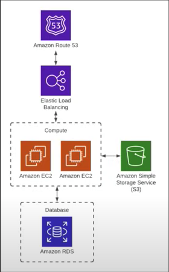
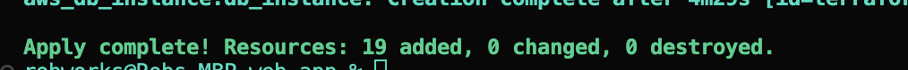
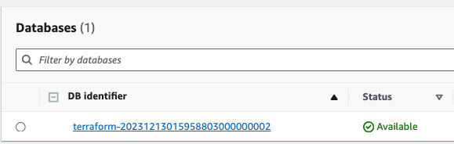

# Complete Terraform Course - From BEGINNER to PRO! (Learn Infrastructure as Code)

## Table of Contents

- [Introduction](#introduction)
- [Features](#features)
- [Getting Started](#getting-started)
- [Usage](#usage)
- [Contributing](#contributing)
- [Acknowledgements](#acknowledgements)
- [Documentation](#documentation)
- [Tasks](#tasks)
- [Notes](#notes)
- [Backend](#backend)
- [Web-app](#web-app)

## Introduction

Learn Terraform by provisioning resources in AWS.

## Features

Highlight key features or functionalities of your project.

- Build web-app with RDS instance, S3 bucket, Load Balancer, 2 EC2 instances, and VPC with security groups

## Getting Started

- Set up Terraform
- Set up AWS User for project
- Set up AWS CLI and Access Keys
- Set up test with simple main.tf file and sample ec2, run terraform plan/apply, and verify in console. Complete with terraform destroy once satisfied with local setup.

### Prerequisites

## Acknowledgements

This is a Youtube course by DevOps Directive - https://www.youtube.com/watch?v=7xngnjfIlK4&list=WL&index=11&t=3274s

## Documentation

- Terraform : https://developer.hashicorp.com/terraform/docs

## Tasks

[x] - Completed Web-app, updated notes with photos
[x] - push to repo, list on portfolio

## Notes

Basic Usage Sequence

- terraform init
- terraform plan
- terraform apply
- terraform destroy

README references

- 

## Backend:

Created backend directory for storing configuration file s3, dynamodb provisioning. Ran terraform init from backend dir, then terrafom plan/apply. Confirmed s3 contains terraform.tfstate file in console

## Web-app:

Pointing web-app main.tf to the existing bucket,

Creating 2 EC2 instances, add to security groups we’ll be setting up for inbound traffic, and then a simple “web server” created by a bash script that says hello world on port 8080

Create a new s3 bucket that will capture web-app data for show if you wanted to store large files for web-app. Including encryption

Using the default VPC, subnets, and defined security groups with rules that allow inbound traffic from all IP address on port 8080 using TCP protocol.

Set up a load balancer on port 80, HTTP (to keep things simple), specify where to send ALB traffic which is the two instances. Then attach instances to target group for ALB. Set up listener rule, but in this case will be all IP paths.

Need to set up slightly different SG for ALB with inbound/outbound traffic rules.

Then define load balancer.

Create route53 zone with A record and point to load balancer.

Lastly we create an RDS instance to show complete full - stack setup.

All resources provisioned !

RDS instance will take awhile....

